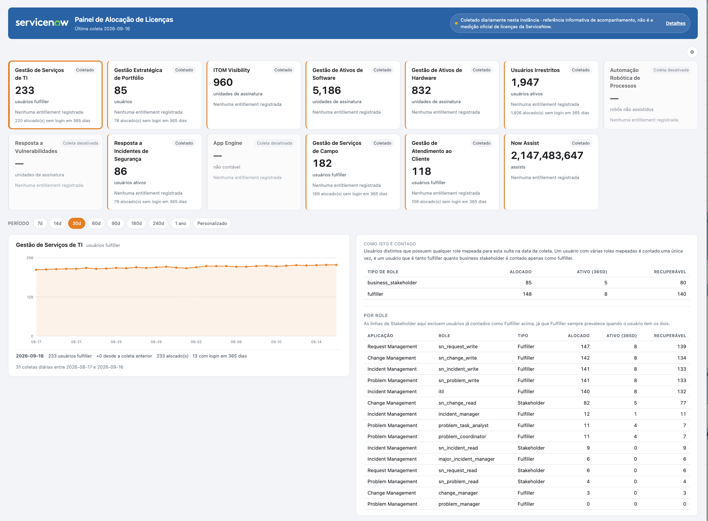
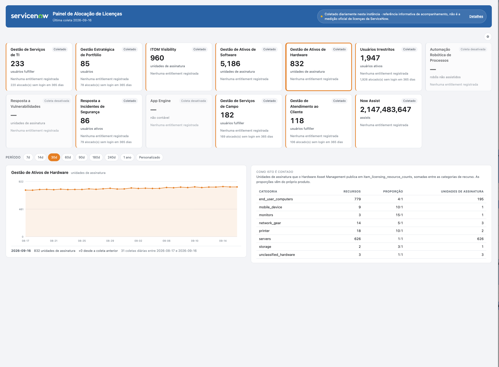
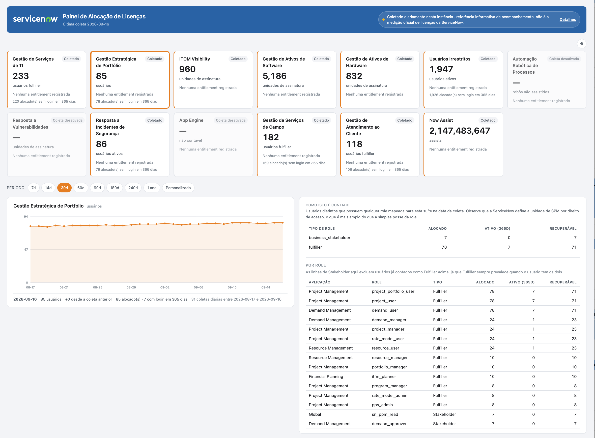
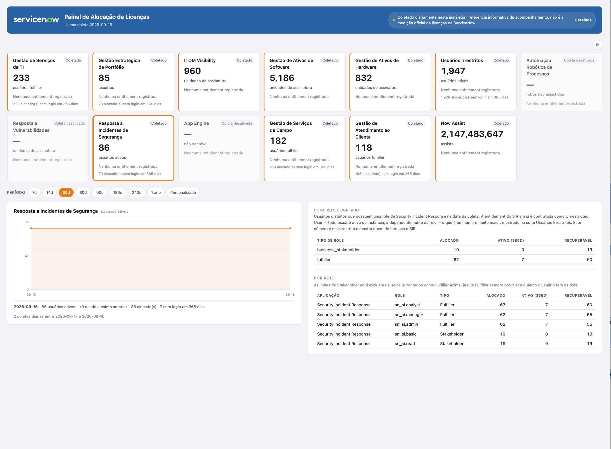

# Painel de Alocação de Licenças

*[Read in English](README.md)*

Uma aplicação escopada do ServiceNow que coleta **a alocação de licenças nesta instância uma vez por dia** e mostra como ela evolui ao longo do tempo, por suíte de produto, com o método de contagem sempre visível ao lado de cada número.

> **Isto não é a medição oficial de licenças da ServiceNow.** O consumo oficial é medido pela ServiceNow através dos seus próprios mecanismos de medição, que podem aplicar critérios, janelas de medição e regras de contagem diferentes. Trate este painel como uma referência interna de acompanhamento, não como uma posição de conformidade.

## Por que ele existe

A ServiceNow reporta o consumo de licenças aos clientes periodicamente, como um documento pontual. Nada na instância mantém um histórico disso, então perguntas como *"essa suíte já estava acima do contratado três meses atrás, ou isso acabou de acontecer?"* não têm resposta local. Esta aplicação responde a isso tirando sua própria fotografia diária e guardando-a.

## Capturas de tela

O painel renderizado em português do Brasil, um card por suíte, com o gráfico de tendência e o detalhe da suíte lado a lado abaixo dos cards:



## Como isto é contado

Existem dois mecanismos, e o painel sempre diz qual deles gerou cada número.

**1. Conta o que os próprios produtos publicam.** A maioria dos produtos com licenciamento próprio já grava suas contagens de recursos, proporções contratuais e unidades de assinatura calculadas em uma tabela da instância — por exemplo `itom_lu_ci_counts` para o ITOM e `itam_licensing_resource_counts` para SAM e HAM. Esta aplicação **lê e soma esses valores publicados**. Ela não reimplementa nenhuma proporção contratual, o que importa porque essas proporções mudam por produto e entre versões de SKU.

Cada produto é descrito por uma linha em **Metric Sources**, então dar suporte a um novo produto é uma mudança de configuração, não de código.



**2. Conta usuários distintos que possuem as roles mapeadas.** ITSM, SPM, FSM e CSM não têm uma tabela publicada assim, então a alocação é contada a partir de `sys_user_has_role`. Duas figuras são registradas:

| Figura | Significado |
|---|---|
| **Alocado** | Possui uma role mapeada, está ativo, tem um User ID e não é uma conta somente de web service |
| **Ativo (365d)** | O mesmo, e também fez login nos últimos 365 dias |

A diferença entre as duas é alocação que provavelmente pode ser recuperada. A condição de 365 dias é o universo que a própria documentação de Subscription Management da ServiceNow descreve, o que torna a segunda figura a mais adequada para comparar com um relatório oficial.

Um usuário com várias roles mapeadas da mesma suíte é contado **uma única vez** — a alocação é por pessoa, não por role. Um usuário que se qualifica tanto como Fulfiller quanto como Business Stakeholder conta apenas como Fulfiller, seguindo a própria definição da ServiceNow para os dois (um Fulfiller é qualquer usuário com direitos maiores que um Business Stakeholder).

Ao abrir uma suíte baseada em role no painel, também aparece um detalhamento **Por role** (por exemplo `itil`, `sn_incident_write`, `sn_change_read`). Essas linhas deliberadamente não são deduplicadas entre roles do mesmo tipo — um usuário com duas roles Fulfiller mapeadas aparece nas duas, do mesmo jeito que o próprio relatório de uso de origem quebra o consumo por role. Uma role de Business Stakeholder é a exceção: ela exclui qualquer usuário já contado como Fulfiller acima, pelo mesmo motivo de exclusão mútua do resumo.



Security Incident Response não tem uma tabela de licenciamento publicada pelo produto nesta instância, então é contada por role como ITSM e SPM — mesmo que sua própria SKU seja contratada como Unrestricted User (todo usuário ativo, independentemente da role). O painel mostra a figura mais restrita, baseada em role, e explica isso no seu texto de metodologia, já que é uma informação muito mais útil do que "todo usuário ativo da instância".



Customer Service Management também é baseada em role, mas com uma omissão deliberada: suas personas externas e de self-service (Customer, Consumer, Partner e roles similares voltadas ao contato externo) não são mapeadas, porque essas não são assentos de Fulfiller/Business Stakeholder — a ServiceNow mede o uso delas separadamente como visitas ao portal do CSM, uma métrica de capacidade que este painel não acompanha. Somente as roles voltadas a agente e gestão de casos contam aqui.

**3. Consumo em nível de conta.** O Now Assist não se encaixa em nenhum dos dois mecanismos acima — ele não é medido por usuário, e não há um detalhamento por categoria para somar. A ServiceNow publica um total acumulado único de **assists** consumidos (um assist é uma unidade de uso de skill do Now Assist, ponderada pela complexidade daquela skill) em `sn_entitlement_genai_assist_analytics`, que acumula ao longo do ciclo contratual anual vigente. Esta aplicação lê essa tabela do mesmo jeito que lê a do ITOM ou do SAM — através de **Metric Sources**, sem código específico — só que se trata de uma única linha por conta, em vez de uma linha por categoria.

## O que vem incluído, e o que não vem

Incluído: o catálogo de suítes (ITSM, SPM, ITOM Visibility, SAM, HAM, Usuários Irrestritos, RPA, Vulnerability Response, SIR, App Engine, Field Service Management, Customer Service Management e Now Assist), a configuração de fontes de métrica para os produtos acima, e um mapeamento padrão das roles-base da ServiceNow para cada suíte baseada em role.

**As entitlements vêm vazias.** As quantidades contratadas são específicas da sua assinatura, então cadastre-as em **Entitlements** a partir dos seus próprios documentos. Sem elas, o painel ainda mostra o consumo, apenas sem nada para comparar.

Suítes cuja medição não pôde ser verificada vêm com a coleta **desativada**. Ative-as depois de verificar o que a tabela de origem delas contém na sua instância.

## Controle de acesso

O menu e todos os módulos são restritos à role de plataforma **`admin`**, e cada uma das cinco tabelas tem sua própria ACL exigindo isso — a aplicação não depende da ACL genérica de wildcard da plataforma, mesmo que ela hoje também exija `admin`. A API REST que o painel lê tem sua própria ACL restrita a `admin` também; sem ela, qualquer usuário interno autenticado poderia chamar os endpoints, já que a ACL REST padrão de fábrica só bloqueia usuários *externos*.

Duas roles vêm com a aplicação (`x_snc_lic_alloc.admin`, `x_snc_lic_alloc.viewer`) como um ponto de extensão documentado, mas ainda não conectado a nenhum controle de acesso — comece por elas quando quiser abrir o acesso para roles de admin específicas de produto (`usage_admin`, `itil_admin`, `sam_admin`, etc.) em vez da `admin` de plataforma.

## Aparência

As cores são configuração da própria aplicação, não do tema Next Experience da instância — uma aplicação genérica e compartilhável não deveria assumir por padrão a marca de um cliente específico. Duas propriedades de sistema controlam isso:

| Propriedade | Finalidade | Padrão |
|---|---|---|
| `x_snc_lic_alloc.theme.primary` | Fundo do cabeçalho | `#1f2933` |
| `x_snc_lic_alloc.theme.accent` | Gráficos e destaques | `#3d68c4` |

Ajuste-as por instância para combinar com a marca do cliente. O logo continua seguindo o `glide.product.image` da própria instância.

## Idioma

O painel segue o idioma da sessão da ServiceNow. Hoje ele vem com inglês (idioma base) e português do Brasil, com o português cobrindo:

- Todo rótulo, cabeçalho e mensagem fixa que o próprio painel React desenha (`src/client/i18n.ts`).
- Nomes de suíte, texto de metodologia e rótulos de role-para-aplicação, traduzidos no servidor (`src/server/handlers/dashboard.ts`) em vez de usar a tabela nativa de tradução por registro da ServiceNow (`sys_translated_text`) — código de aplicação escopada é bloqueado de escrever nessa tabela mesmo com um privilégio explícito de cross-scope create/write concedido, então isso mantém a tradução inteiramente dentro do código da aplicação, em vez de depender de um administrador da instância aprovar acesso cross-scope em cada instalação.
- Rótulos de tabela, campo e choice das 5 tabelas da própria aplicação (`sys_documentation` / `sys_choice`, semeados via `src/fluent/seed/dictionary-pt-br.now.ts` e `choices-pt-br.now.ts`), para que as visões nativas de lista e formulário também fiquem traduzidas. O vocabulário de SKU/unidade de medida (Subscription Unit, Fulfiller, Business Stakeholder etc.) é deixado em inglês de propósito, já que esses são os termos literais que aparecem numa cotação da ServiceNow.

**Lacuna conhecida:** os itens do Application Navigator (o menu "License Allocation" e seus 6 módulos) permanecem em inglês independentemente do idioma da sessão — a mesma restrição de `sys_translated_text` acima bloqueia traduzi-los, e não existe uma solução só em código de aplicação para a navegação renderizada pela plataforma.

Adicionar outro idioma significa estender `Lang`/`STRINGS` em `src/client/i18n.ts`, as tabelas no estilo `SUITE_TEXT_PB`/`APPLICATION_LABEL_PB`/`SOURCE_LABEL_PB` e `sessionLang()` em `dashboard.ts`, e executar novamente o gerador de seed do dicionário/choices para as linhas de `sys_documentation`/`sys_choice` daquele idioma.

## Instalação

1. Instale a aplicação.
2. Configure `x_snc_lic_alloc.theme.primary` e `x_snc_lic_alloc.theme.accent` se quiser que o painel siga a marca de um cliente específico.
3. Abra **License Allocation → Product Collection** e ative as suítes que deseja coletar.
4. Abra **License Allocation → Entitlements** e cadastre suas quantidades contratadas.
5. Execute **License Allocation - Daily Collection** manualmente uma vez, em vez de esperar a execução noturna, para confirmar que está funcionando.
6. Abra **License Allocation → Dashboard**.

### Leituras cross-scope

O coletor lê tabelas de outras aplicações. Se a tabela de licenciamento de um produto for restrita ao próprio escopo, o coletor registra `Source not present` ou um erro de coleta para aquela suíte em vez de falhar, e a instância pode solicitar que um administrador aprove o acesso cross-scope. Nada mais deixa de funcionar quando uma fonte fica indisponível.

A tabela de uso do Now Assist (`sn_entitlement_genai_assist_analytics`) é protegida de forma mais rígida que as outras — uma aplicação escopada precisa de uma concessão explícita de leitura, não apenas da aprovação automática usual da plataforma, ou o coletor falha com `ScopeAccessNotGrantedException`. Esta aplicação já inclui essa concessão (`src/fluent/acl/cross-scope.now.ts`), então deve funcionar de fábrica; se uma instância mais restrita ainda bloquear, um administrador pode aprovar o acesso cross-scope a essa tabela em **System Applications → Studio → Cross-Scope Access**.

## Navegação

| Módulo | Finalidade |
|---|---|
| **Dashboard** | Alocação por suíte, com histórico e seletor de período |
| **Product Collection** | O interruptor de ligar/desligar por suíte, além do método de contagem e texto de metodologia |
| **Metric Sources** | Em qual tabela cada produto publica suas contagens, e quais campos ler |
| **Role to Suite Mapping** | Quais roles consomem qual suíte |
| **Entitlements** | Suas quantidades contratadas |
| **Daily Snapshots** | As linhas brutas coletadas, para auditar qualquer número do painel |

## Comportamento do painel

Janelas de período de 7, 14, 30, 60, 90, 180, 240 e 365 dias, além de um intervalo de datas personalizado. A série é desenhada a partir das fotografias diárias, então só mostra os dias em que a coleta de fato executou — ela não interpola.

## Diferenças conhecidas em relação à medição oficial

Essas são esperadas, e são o motivo do aviso:

- **ITOM** é medido oficialmente como uma média das últimas 90 contagens diárias. Este painel mostra a figura diária.
- As unidades de assinatura do **Vulnerability Response** são medidas oficialmente numa janela de 30 dias.
- **Herança de role** é contada aqui sempre que um usuário efetivamente possui uma role mapeada. Como a ServiceNow trata roles herdadas na sua própria contagem não é documentado publicamente.
- As SKUs de attach do **App Engine** são precificadas como um percentual do gasto líquido, o que não é uma quantidade contável, então nenhuma figura de consumo é produzida.
- **Security Incident Response** é contratado como Unrestricted User (todo usuário ativo da instância), mas é mostrado aqui como alocação baseada em role — uma figura muito mais restrita e útil. Veja "Como isto é contado" acima.
- As roles externas/self-service do **Customer Service Management** são excluídas da contagem por design — veja "Como isto é contado" acima.
- Os assists do **Now Assist** acumulam ao longo do ciclo contratual anual vigente em vez de zerar diariamente, então o gráfico de tendência mostra uma linha crescente mesmo num dia sem consumo incremental registrado — esse é o total acumulado, não consumo novo.
- A reconciliação final de qualquer assinatura acontece do lado da ServiceNow, não na instância.

## Desenvolvimento

Construído com o ServiceNow SDK (Fluent) e um front-end React em uma UI Page.

```bash
git clone https://github.com/glauccop/sn_license_dashboard.git
cd sn_license_dashboard
npm install
now-sdk auth --add <sua-instancia> --type basic
npm run build
npm run deploy
```

`now-sdk deploy` instala (ou atualiza) a aplicação diretamente na instância em que você se autenticou — não há update set ou XML para importar manualmente.

Layout do código-fonte:

```
src/fluent/     metadados da aplicação: tabelas, roles, menu, REST API, job agendado, dados de seed
src/server/     lógica do lado servidor: o Script Include coletor e os handlers REST
src/client/     o painel React
```

Relatórios de uso de clientes e qualquer outro dado de cliente pertencem a `reference-data/`, que está no `.gitignore`. Não os comite.

## Suporte e contribuição

Encontrou um bug, tem uma pergunta ou quer que um produto seja adicionado em "Como isto é contado"? [Abra uma issue](https://github.com/glauccop/sn_license_dashboard/issues).

Contribuições são bem-vindas como pull requests. Algumas coisas que facilitam a revisão de um PR, dado como esta aplicação é construída:

- Metadados (`src/fluent/**/*.now.ts`) são Fluent — apenas valores literais. O compilador rejeita valores computados, indexação de array e loops dentro de uma chamada `Record()`/builder (`now-sdk build` avisa imediatamente se isso acontecer).
- Novos produtos licenciados entram em `src/fluent/seed/sources.now.ts` como uma nova linha de `Metric Source` (tabela, nomes de campo, proporção) quando o produto já publica suas próprias contagens de unidades de assinatura — isso é uma mudança de dado, não de código. Um `counting_method` que você ainda não viu é o único motivo para tocar em `LicenseUsageCollector.server.js`.
- Execute `npm run build` antes de abrir um PR; ele faz type-check da aplicação inteira e pega a maioria dos erros específicos do Fluent.

## Licença

[MIT](LICENSE)
